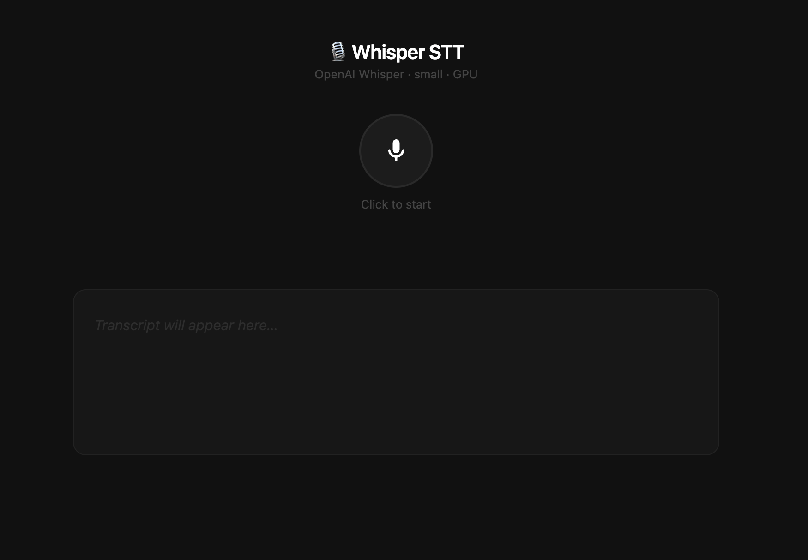

# Whisper_app
Rolling, GPU-accelerated speech-to-text using OpenAI Whisper (small).


# Whisper STT — FastAPI + WebSocket

Rolling, GPU-accelerated speech-to-text using OpenAI Whisper (small).

## Project layout

```
whisper_app/
├── main.py             # FastAPI app + WebSocket transcription logic
├── static/
│   └── index.html      # Frontend (served by FastAPI)
├── models/
│   └── small.pt        # ← put your model here
├── requirements.txt
└── README.md
```

## Setup

```bash
# 1. Install deps (torch with CUDA must already be present)
pip install -r requirements.txt

# 2. Put your model in place
mkdir -p models
cp /path/to/your/small.pt models/small.pt

# 3. Run
uvicorn main:app --host 0.0.0.0 --port 8000
```

Then open **http://localhost:8000** in Chrome.

## Config (top of main.py)

| Variable | Default | Description |
|---|---|---|
| `WHISPER_MODEL_PATH` | `models/small.pt` | Path to your `.pt` file (env override supported) |
| `DEVICE` | auto (cuda/cpu) | Detected from `torch.cuda.is_available()` |
| `ROLLING_EVERY_N_CHUNKS` | `3` | Trigger partial transcription every N × 1-second chunks |
| `LANGUAGE` | `"en"` | Whisper language hint (`None` = auto-detect) |

## How it works

1. Browser MediaRecorder sends **1-second WebM/Opus chunks** over WebSocket.
2. Server accumulates them into a growing byte buffer (concatenated WebM stays valid — the first chunk carries the container header).
3. Every 3 new chunks (~3 s), Whisper runs on the **full buffer** in a thread-pool executor (event loop stays free), sends back `{type: "partial", text: "…"}`.
4. On toggle-off the server waits for any in-flight job, runs one final pass, sends `{type: "final", text: "…"}`.

## Notes

- Tested on Chrome. Firefox should also work (`audio/ogg;codecs=opus` fallback is handled).
- ffmpeg must be on PATH — Whisper uses it internally to decode audio.
  ```bash
  # Ubuntu/Debian
  sudo apt install ffmpeg
  ```
